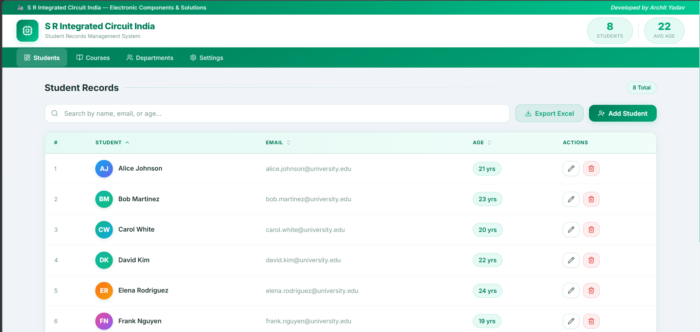

# 🎓 Student Records Management System

<div align="center">


**A full-featured student management table built with React + Vite**
*Developed by **Archit Yadav** for S R Integrated Circuit India*

[Live Demo](https://student-records-mangement-system-frontend-54v34tprn.vercel.app/) · [Report Bug](#) · [Request Feature](#)

</div>

---

## 📸 Preview



> Light theme with green branding — **S R Integrated Circuit India** | Developed by **Archit Yadav**

---

## ✨ Features

- 📋 **Student Table** — Name, Email, Age with color-coded avatar initials
- ➕ **Add Student** — Form with real-time validation (name, email, age)
- ✏️ **Edit Student** — Pre-filled modal with the same validation rules
- 🗑️ **Delete Student** — Confirmation dialog before removal
- 🔍 **Live Search** — Filter by name, email, or age instantly
- ↕️ **Column Sorting** — Ascending / descending sort on all columns
- 📄 **Pagination** — 5 / 10 / 20 rows per page selector
- 📊 **Excel Export** — Downloads filtered or full data as `.xlsx`
- 🔔 **Toast Notifications** — Auto-dismiss feedback for every action
- ⏳ **Simulated Loading** — Spinner on form submit (async UX)
- 📱 **Responsive** — Works on desktop, tablet & mobile

---

## 🛠️ Tech Stack

| Technology | Version | Purpose |
|---|---|---|
| [React](https://react.dev/) | 18.3.1 | UI framework |
| [Vite](https://vitejs.dev/) | 5.4.2 | Build tool & dev server |
| [xlsx](https://www.npmjs.com/package/xlsx) | 0.18.5 | Excel file export |
| [lucide-react](https://lucide.dev/) | 0.441.0 | Icon library |
| Vanilla CSS | — | Custom design system |

> **All data is in-memory** — no backend or database required.

---

## 🚀 Getting Started

### Prerequisites

- Node.js `>=18`
- npm `>=9`

### Installation

```bash
# 1. Clone the repository
git clone https://github.com/your-username/student-table-frontend.git
cd student-table-frontend

# 2. Install dependencies
npm install

# 3. Start the development server
npm run dev
```

Open [http://localhost:5173](http://localhost:5173) in your browser.

### Build for Production

```bash
npm run build
```

Output will be in the `dist/` folder.

---

## 📁 Project Structure

```
src/
├── components/
│   ├── StudentTable.jsx    # Sortable, paginated table
│   ├── StudentForm.jsx     # Add / Edit modal form
│   └── DeleteDialog.jsx    # Confirmation dialog
├── context/
│   └── ToastContext.jsx    # Global toast notifications
├── data/
│   └── students.js         # Seed data (in-memory)
├── utils/
│   └── helpers.js          # Excel export, validation, utilities
├── App.jsx                 # Root component & state management
├── index.css               # Design system (light green theme)
└── main.jsx                # React entry point
```

---

## 🌐 Deployment

### Vercel (Recommended)

```bash
npm i -g vercel
vercel --prod
```

### Netlify

```bash
npm run build
# Drag the dist/ folder to app.netlify.com/drop
```

---

## 📋 Assignment Requirements Checklist

- [x] Student list with Name, Email, Age, Actions columns
- [x] Add Student form with validation (all fields mandatory, valid email)
- [x] Edit Student with pre-filled data and same validations
- [x] Delete Student with confirmation dialog
- [x] Simulated loading state
- [x] Excel download (filtered rows or full data)
- [x] Frontend-only (in-memory state, no backend)

---

## 👨‍💻 Author

**Archit Yadav**


---

## 📄 License

This project is licensed under the [MIT License](LICENSE).
